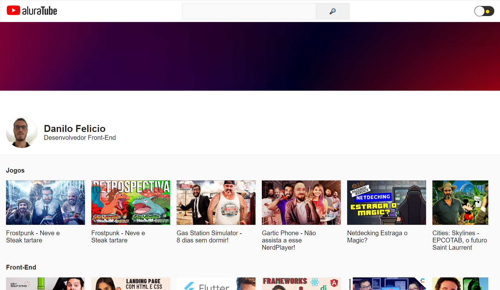

<h1 align="center"> Imersão React Alura </h1>

Evento exclusivo e gratuito, promovido pela Alura para ensino de tecnologias WEB.

  <a href="#-tecnologias">Tecnologias</a>&nbsp;&nbsp;&nbsp;|&nbsp;&nbsp;&nbsp;
  <a href="#-projeto">Projeto</a>

 

  

 

## 🔗 Link Acesso
### Link abaixo para acessar
<a href="https://aluratube-danilofelicio.vercel.app/" target="_blank" style="font-size:20px;">Clique aqui</a>

 

## 🚀 Tecnologias

Esse projeto foi desenvolvido com as seguintes tecnologias:

- HTML e CSS
- Git e Github
- React

## 💻 Projeto

Projeto de uma versão simplista do YouTube, onde é possivel pesquisar vídeos disponíveis no site, bem como mudar os temas da página de light para dark e vice-versa.
